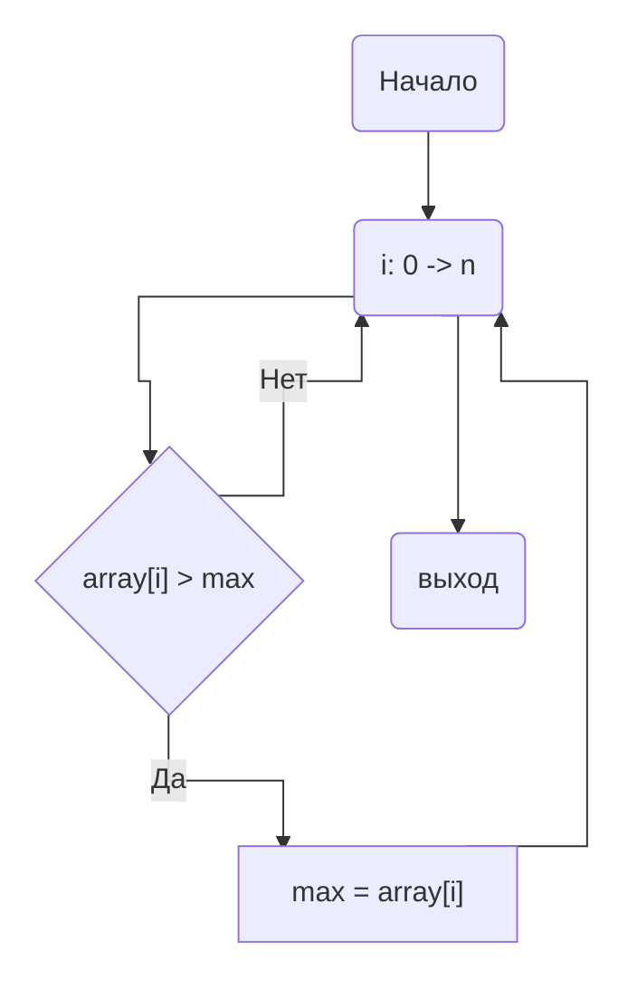
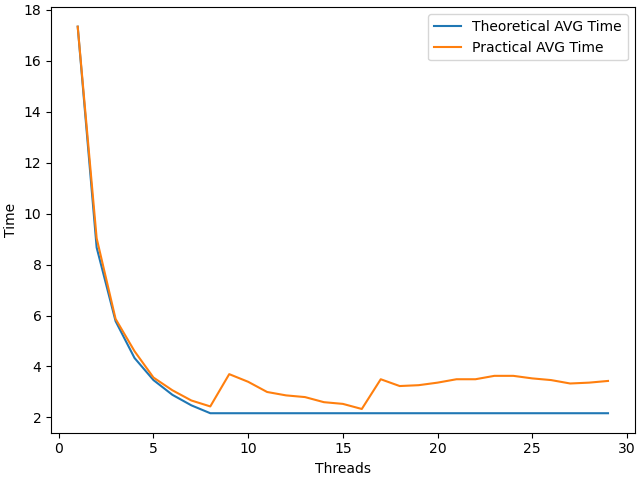
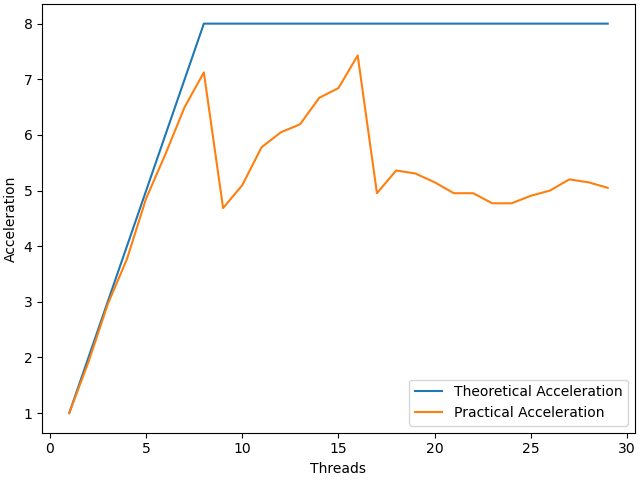
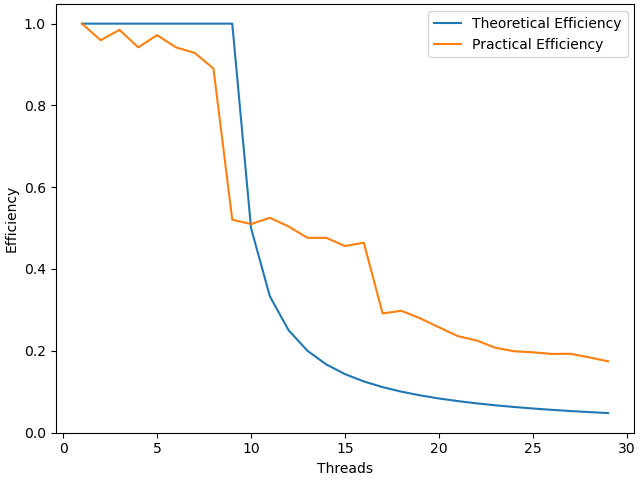

# НИЯУ МИФИ. Лабораторная работа №1. Давыдов Михаил, Б21-502. 2023
---

### Используемая система

**Операционная система** - Linux 6.6.7-arch1-1 x86_64

**Модель процессора** - 12th Gen Intel® Core™ i5-12500H

**Оперативная память** - LPDDR4 3733 MT/s 16GB

**Среда разработки** - `Neovim`

**Версия OpenMP** - `201511`


### Временная оценка алгоритма
`p` - Количество используемых потоков 

`n` - Длина массива чисел

* **"Время работы"**
    - Последовательный: `O(n)`
    - Параллельный:   `O(n/p)`
    
 * **Ускорение:** `O(p)`
 * **Эффективность:** `O(1)`

### Анализ алгоритма

#### Принцип работы

Приведенный ниже алгоритм проходится по массиву чисел и производит сравнение каждого с максимальным для данного треда. Если элемент оказывается больше текущего максимума, то переменной max присваивается его значение, иначе алгоритм начинает следующую итераци.
После выполнения итерационной части полученной локальное для потока максимальное значение (переменная `max`) сравниватеся с аналогичиными переменными `max` из `shared` области (общей для всех потоков) и среди них выбирается наибольшее. Таким образом после выполнения итерационной части потока наибольший элемент будет храниться в переменной max из shared области.


### Блок-схема



### Значение директив
`#pragma omp parallel num_threads(threads) shared(array, count) reduction(max: max) default(none)`
Задается параллельная обасть, с количеством потоков threads. Переменные array и count объявляются общими для всех потоков и непараллельной части алгоритма.

Область - цикл `for + printf("-- My lmax is: %d;\n", max)`. Если бы ее не было то цикл просто выполнился бы последовательно.

`#pragma omp for`
Задается директива относящаяся к циклу for идущему сразу после нее, c её помощью выполняется распараллеливагие цикла с в соответствии со значением schedule.

Область - цикл `for`
Если бы ее не было то цикл выполнился бы `thread` раз, каждый раз находя один и тот же максимальный элемент.


### Ускорение и эффективность







### Дополнительные вопросы
**Почему график теоретической эффективность потока принимает такой вид?**

Одно ядро будет выполнять `THREADS/SYS_MAX_PROCESSORS` задач при `THREADS >  SYS_MAX_PROCESSORS`

**Почему экспериментальный график ускорения имеет пилообразную форму?**

Пилообразная форма графика при `THREADS > SYS_MAX_PROCESSORS` обусловлена тем, что по теореме Дирихле, на каждое ядро будет разное количество потоков. Таким образом некоторые ядра будут выполнять целую часть от `THREADS / SYS_MAX_PROCESSORS` потоков, а другие на один больше. Программа будет ждать завершения работы всех потоков, что приведет к замедлению в областях с `THREADS != SYS_MAX_PROCESSORS * n`.

По указаной выше причине график ускорения имеет пилообразную форму.

### Заключение

В данной работе мы познакомились с основами использования библиотеки OpenMP в язке C. Также установлено, что ожидаемое время работы и ускорения не всегда совпадает с реальным значениями. После построения графиков мы сделали вывод о том, что после 16 потоков прекращается рост ускорения и среднее время исполнения не уменьшается.

### Приложение

Оценка работы последовательной программы исполнялось при передачи одного потока в аргументы данной программы:

```c
#include <bits/types/struct_timeval.h>
#include <limits.h>
#include <stdio.h>
#include <stdlib.h>
#include <sys/time.h>

long long Time() {
    struct timeval tv;
    gettimeofday(&tv, NULL);

    return tv.tv_sec*1000 + tv.tv_usec/1000;
}

int main(int argc, char **argv) {

    size_t arraySize = 20000000l;

    // maximal element
    int max = -1;

    // check correct usage
    if (argc != 3) {
        fprintf(stderr, "Usage: %s {THREAD_NUM} {SEED}", argv[0]);
        return 1;
    }

    int threadNum = atoi(argv[1]);  // Thread Amount
    int seed = atoi(argv[2]);       // Seed for initialization of random
    
    // Check for overflow or invalid argument in the first place
    if (threadNum <= 0) {
        fprintf(stderr, "Provide thread number in range: 1 - %d", INT_MAX);
        return 1;
    }

    // Random init
    srand(seed);

    int *array = calloc(arraySize * sizeof(int), 1);

    //array initialization with random values
    for (int i = 0; i < arraySize; i++) {
        array[i] = rand();
    }

    struct timeval tv;
    gettimeofday(&tv, NULL);

    long long startTime = Time();

    // omp pragma for initialization of the parallelism
    #pragma omp parallel num_threads(threadNum) shared(array, arraySize) reduction(max: max) default(none)
    {
        // parallelism for the loop
        #pragma omp for
        for (size_t i = 0; i < arraySize; i++) {
            if (array[i] > max) { 
                max = array[i];
            }
        }
    }

    // print time that the calculations took
    // НЕЛЬЗЯ ВОЗВРАЩАТЬ, ПОТОМУ ЧТО ЗНАЧЕНИЕ ИМЕЕТ НЕ ТИП INT. ВОЗМОЖНЫ ПОГРЕШНОСТИ.
    printf("Took: %lld", Time() - startTime);
    return 0;
}
```
