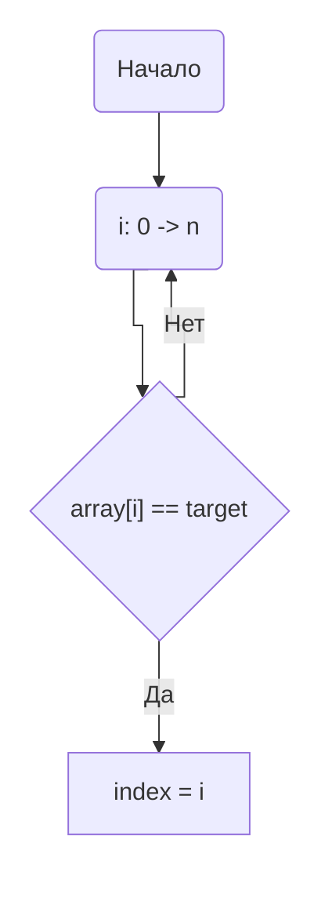
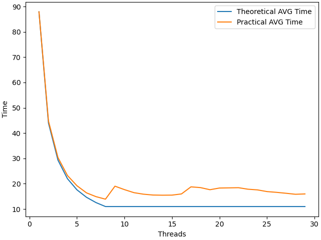
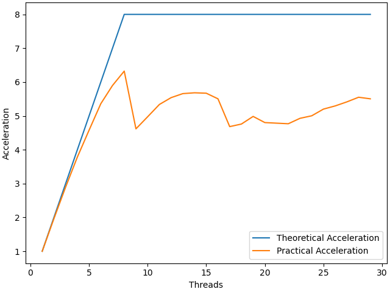
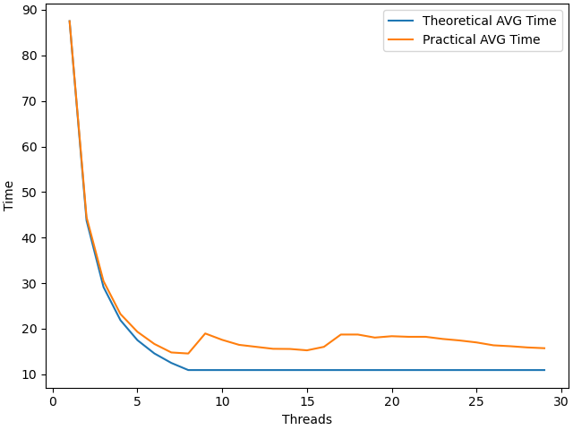
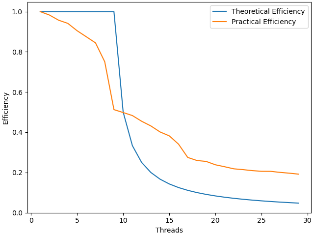

# НИЯУ МИФИ. Лабораторная работа №2. Давыдов Михаил, Б21-502. 2023
---

### Используемая система

**Операционная система** - Linux 6.6.7-arch1-1 x86_64

**Модель процессора** - 12th Gen Intel® Core™ i5-12500H

**Оперативная память** - LPDDR4 3733 MT/s 16GB

**Среда разработки** - `Neovim`

**Версия OpenMP** - `201511`


### Анализ алгоритма

### Оценка временной сложности

 - **Лучший случай:** `O(1)`
 - **Худший случай:** `O(n)`
 - **Средний случай:** `O(n)`

### Принцип работы

Приведенный ниже алгоритм итерируется по массиву из чисел и выполняет сравнение их с заданным элементом `target`. Если элемент массива оказывается равен перменной `target`, переменная `index` принимает значение индекса данного элемента в массиве.

### Блок-схема



### Значение директив

`#pragma omp for`

Задается директива относящаяся к циклу `for` идущему сразу после нее, выполняется распараллеливагие цикла в соответствии со значением `schedule`.

Область `#pragma omp parallel num_threads(threads) shared(array, count, target) reduction(max: index) default(none)`

Задается параллельная область, с количеством потоков `threads`. Переменные `array, count, target` объявляются общими для всех потоков и непараллельной части алгоритма и далее находится максимальный результат среди найденных при помощи редукции. Если ни один поток не нашел заданного элемента, то результат будет -1, тогда программа ничего не выведет.
Если бы ее не было то цикл выполнился бы `thread` раз, каждый раз находя один и тот же максимальный элемент.

`#pragma omp cancel for` нужна, для того чтобы параллельный алгоритм закончил свое выполнение, если был найден заданный элемент в массиве.

### Ускорение и эффективность с использованием cancel for






### Ускорение и эффективность без использования cancel for






### Дополнительные вопросы

**Почему график теоретической эффективность потока принимает такой вид?**

Одно ядро будет выполнять `THREADS/SYS_MAX_PROCESSORS` задач при `THREADS >  SYS_MAX_PROCESSORS`

**Почему экспериментальный график ускорения имеет пилообразную форму?**

Пилообразная форма графика при `THREADS > SYS_MAX_PROCESSORS` обусловлена тем, что по теореме Дирихле, на каждое ядро будет разное количество потоков. Таким образом некоторые ядра будут выполнять целую часть от `THREADS / SYS_MAX_PROCESSORS` потоков, а другие на один больше. Программа будет ждать завершения работы всех потоков, что приведет к замедлению в областях с `THREADS != SYS_MAX_PROCESSORS * n`.

По указаной выше причине график ускорения имеет пилообразную форму.

**Как оптимизировать алгоритм, чтобы он завершался, если один из потоков найдет индекс элемента?**

Одной из опций является добавление `#pragma cancel for`. Различия в графиках милимальны так как при случайном распределении функции `rand()` искомый элемент находится редко.
На графике `acceleration` при использовании ~14 потоков, можно заметить небольшую разницу, при использовании `#pragma cancel`, ускорение чуть больше. 


### Заключение

В данной работе мы приобрели навыки разработки параллельной программы путем обнаружение ресурса параллелизма в имеющейся последовательной реализации.

```c

#include <bits/types/struct_timeval.h>
#include <limits.h>
#include <stdio.h>
#include <stdlib.h>
#include <sys/time.h>

long long Time() {
    struct timeval tv;
    gettimeofday(&tv, NULL);

    return tv.tv_sec*1000 + tv.tv_usec/1000;
}

int main(int argc, char** argv)
{
  const int count = 100000000;     ///< Number of array elements
  const int target = 16;          ///< Number to look for

  int  index = -1;                ///< The index of the element we need
  if (argc < 3){
    puts("USAGE ./a.out {THREADS_NUM} {SEED}");
    return -1;
  }
  int threads = atoi(argv[1]);         ///< Number of parallel threads to use
  int random_seed = atoi(argv[2]); ///< RNG seed
  if (threads <= 0 ) {
        puts("Provide valid amount of threads.");
        return 1;
  }

  srand(random_seed);

  int *array = malloc(count*sizeof(int));
  if (!array) {
        puts("Could not allocate memory");
    }
  for(int i=0; i<count; i++){ 
    array[i] = rand(); 
  }

  

  long long time_start = Time();
   // We can multithread index finding
  #pragma omp parallel num_threads(threads) shared(array, count, target) reduction(max: index) default(none)
  {
    #pragma omp for
    for(int i=0; i<count; i++)
    {   
        if(array[i] == target)
        {
            index = i;
            #pragma omp cancel for
        }
    }
  }
  free(array);
  if(index != -1){
    printf("Found occurence of %d at index %d;\n", target, index);
  }

  printf("%lld", Time() - time_start);
  return 0;
}
```
```
