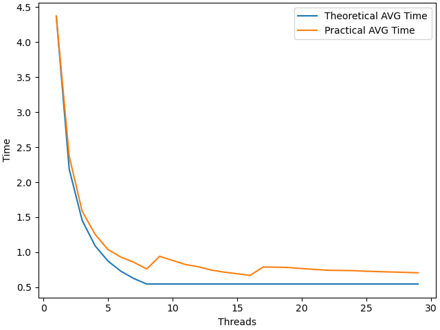
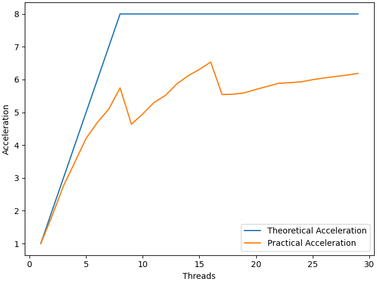
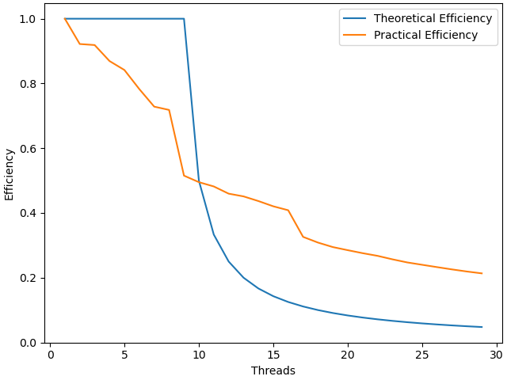

# НИЯУ МИФИ. Лабораторная работа №3. Давыдов Михаил, Б21-502. 2023
---

### Используемая система

**Операционная система** - Linux 6.6.7-arch1-1 x86_64

**Модель процессора** - 12th Gen Intel® Core™ i5-12500H

**Оперативная память** - LPDDR4 3733 MT/s 16GB

**Среда разработки** - `Neovim`

**Версия OpenMP** - `201511`

### Анализ алгоритма

### Оценка временной сложности

- Если массив уже отсортирован - `O(n*log(n))` ( Best case )
- Worst case `O(n^2)`


### Анализ алгоритма

#### Блок схема


### Значение директив

`#pragma omp parallel for shared(gap, count, array) private(i, j, tmp, part) default(none) num_threads(threads)`

Задается обасть параллельного цикла, с количеством потоков, равное `threads`. Переменные `array`, `count` и `gap` объявляются общими для всех потоков и непараллельной части алгоритма. Все новые переменные без явного указания класса не разрешены. Переменные `i, j, tmp` и `part` объявляется индивидуальной для каждого треда.

Область - цикл `for`
Эта директива необходима для распараллеливания сортировки элементов массива, которые отстоят друг от друга на расстоянии gap, потому что они не пересекаются с остальными и соответственно уменьшения время всей сортировки.


### Параллельный алгоритм

Для измерений с усреднением по количеству лучших и худших случаев использовался вспомогательный python код, который запустил исходный код 200 раз.

### Среднее время



### Среднее ускорение



### Средняя эффективность



## Заключение
В данной работе мы разработали и реализовали параллельный алгоритм сортировки Шелла. Ускорение возможно, потому что во втором вложенном цикле происходит сортировка "Пузырьком", для которой возможно применить принцип параллелизма, так как он работает с непересекающимися множествами.

Анализ графиков показал, что:
 - После 16 потоков ускорения не происходит.


## Приложение
Оценка работы последовательной программы производилось при использовании параллельной программы с одним потоком.
### Программа для оценки времени работы алгоритма сортировки

```c

#include <omp.h>
#include <stdio.h>
#include <limits.h>
#include <stdlib.h>

double shellsort(int *array, int count, int threadNum) {
    double startTime = omp_get_wtime();
    int i, j, tmp, part;

    for (int gap = count / 2; gap > 0; gap /= 2) {
        #pragma omp parallel for shared(gap, count, array) private(i, j, tmp, part) default(none) num_threads(threadNum)
      for(i = 0; i < gap; i++){
            for(part = i + gap; part < count; part += gap){
                for(j=part; j>i  && array[j-gap] > array[j]; j-=gap){
                    tmp = array[j];
                    array[j] = array[j-gap];
                    array[j-gap] = tmp;
                }
            }
        }
    }
    // get current time
    return omp_get_wtime() - startTime;
}

int main(int argc, char **argv) {
    size_t arraySize = 20000000l;

    // maximal element
    int max = -1;

    // check correct usage
    if (argc != 3) {
        fprintf(stderr, "Usage: %s {THREAD_NUM} {SEED}", argv[0]);
        return 1;
    }

    int threadNum = atoi(argv[1]);  // Thread Amount
    int seed = atoi(argv[2]);       // Seed for initialization of random
    
    // Check for overflow or invalid argument in the first place
    if (threadNum <= 0) {
        fprintf(stderr, "Provide thread number in range: 1 - %d", INT_MAX);
        return 1;
    }

    // Random init
    srand(seed);

    int *array = calloc(arraySize * sizeof(int), 1);

    //array initialization with random values
    for (int i = 0; i < arraySize; i++) {
        array[i] = rand();
    }
    fprintf(stdout, "%g", shellsort(array, arraySize, threadNum));

    return 0;
}
```
