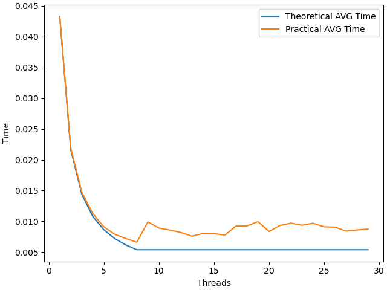
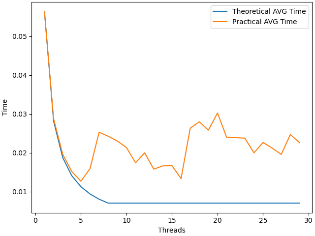
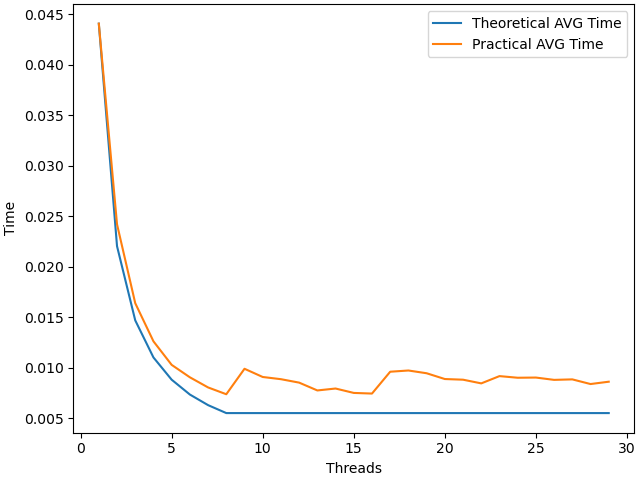
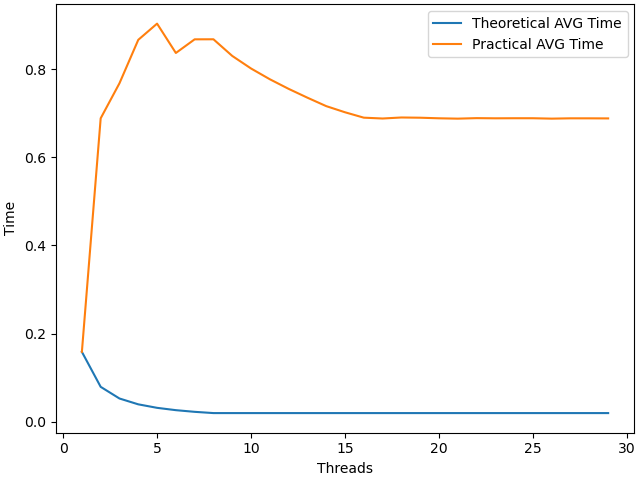
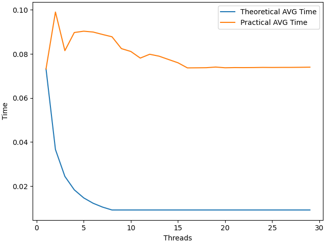
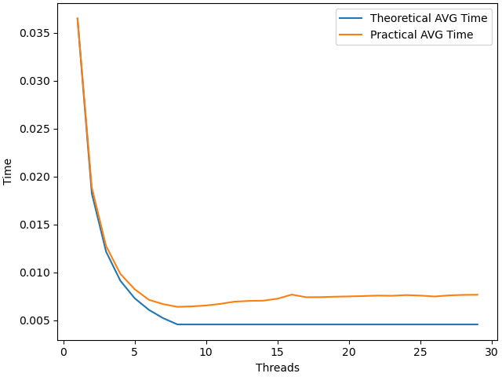
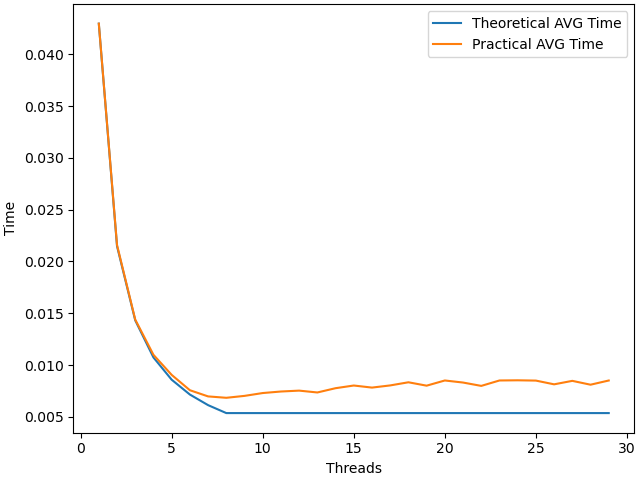
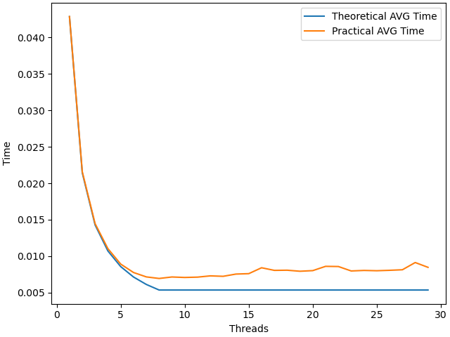
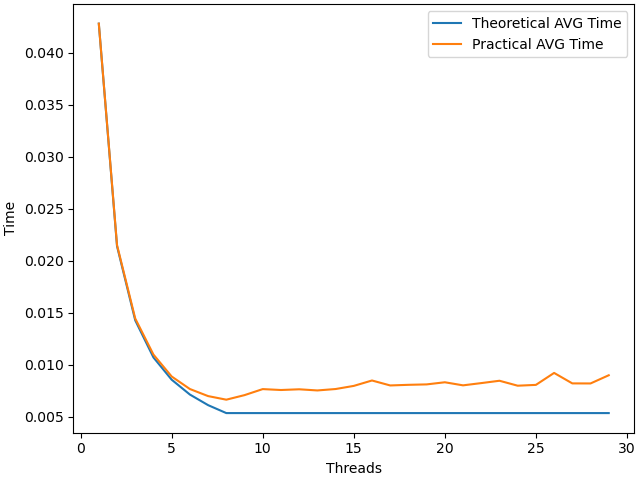

# НИЯУ МИФИ. Лабораторная работа №4. Давыдов Михаил, Б21-502. 2023
---

### Используемая система

**Операционная система** - Linux 6.6.7-arch1-1 x86_64

**Модель процессора** - 12th Gen Intel® Core™ i5-12500H

**Оперативная память** - LPDDR4 3733 MT/s 16GB

**Среда разработки** - `Neovim`

**Версия OpenMP** - `201511`


### Информация о среде OpenMP

 - Версия `Version: 201511`

 - Дата принятия стандарта `OpenMP: Date(m/y): 11/2015`

 - Количество доступных процессоров: `Number of processors: 16`

 - Количество доступных потоков: `Number of max threads: 16`

 - Можно ли использовать динамическую настройку количества используемых потоков во время работы? Нет: `Dynamic is enabled: 0`

 - Точность таймера: `Timer precision: 1e-09s`

 - особенности работы со вложенными параллельными областями `Nested parallelism enabled: 0. Max number of nested active parallel regions: 1`

 - Текущее распределение нагрузки: `Schedule kind is dynamic, chunk size is 1` <br>


## Пример использования `omp_set_lock()`

Ниже представлен пример программы, которая исползует API функцию `omp_set_lock()` для синхронизации записи в переменную. Данный метод крайне неэффективен, однако подходит в целях демонстрации.

```c
#include <stdio.h>
#include <unistd.h>
#include <omp.h>

omp_lock_t lock;

int main(){
    size_t result = 0;
    int tmp = 0;

    #pragma omp parallel for private(n) shared(g) num_threads(5000)
    for (size_t i = 0; i < 5000; i++) {
        tmp = omp_get_thread_num();
        omp_set_lock(&lock);
        result += tmp;
        omp_unset_lock(&lock);
    }

    omp_destroy_lock(&lock);
    printf("%ld\n", result);

    return 0;
}
```
При использовании механизма блокировки с помощью функции `omp_set_lock()` программа выводит корректный ответ равный `12497500`, однако если убрать данный механизм, результат программы будет варьироваться и с большой долей вероятности будет неверным.

### Сравнительный анализ.

Для проведения сравнительного анализа типов разделения нагрузки и размеров фрагмента воспользуемся программой из лабораторной работы номер 1.
В рамках анализа рассмотрены следующие значения переменных величин:

- Типы schedule
     * Static
     * Dynamic
     * Guided

- Размеры используемых чанков
     * `default`
     * 10 
     * 1000

### Результаты анализы

##### Тип Static

**Chunk size = default**

**Chunk size = 10**

**Chunk size = 1000**

##### Тип Dynamic

**Chunk size = default**

**Chunk size = 10**

**Chunk size = 1000**


##### Тип Guided

**Chunk size = default**

**Chunk size = 10**

**Chunk size = 1000**

### Анализ результатов
Анализ результатов показывает, что для данного примера разделение по типу `dynmaic` и `guided` не имеет смысла в силу отсутствия барьеров исполнения.
Динамический же вариант показывает подобные результаты из-за синхронизации потоков, что негативно сказывается на скорости работы в данном случае.

### Заключение
В данной работе мы рассмотрели основные API функции среды OpenMP, позволяющие получать её характеристики. Был рассмотрен механизм замков и предложен пример программы, использующей его. Было проведено сравнение различных типов `schedule`, использующегося в циклах для распределения нагрузки, на примере кода из первой лабораторной работы.

### Приложение
```c
#include <stdio.h>
#include <stdlib.h>
#include <omp.h>
#include<sys/time.h>

int main(int argc, char** argv)
{
  const int count = 50000000;     ///< Number of array elements
  if (argc < 3){
    puts("USAGE ./a.out {THREADS_NUM} {SEED}");
    return -1;
  }
  const int threads = atoi(argv[1]);         ///< Number of parallel threads to use
  const int random_seed = atoi(argv[2]); ///< RNG seed

  int* array = 0;                 ///< The array we need to find the max in
  int  max   = -1;                ///< The maximal element

  /* Initialize the RNG */
  srand(random_seed);

  /* Generate the random array */
  array = (int*)malloc(count*sizeof(int));
  for(int i=0; i<count; i++) { array[i] = rand(); }

  /* Find the maximal element */
  double t = omp_get_wtime();
  #pragma omp parallel num_threads(threads) shared(array, count) reduction(max: max) default(none)
  {
      #pragma omp for schedule(guided, 1000)
      for(int i=0; i<count; i++)
      {
          if(array[i] > max) { max = array[i]; };
      }
  }
  printf("%g", omp_get_wtime() -t );
}
```
