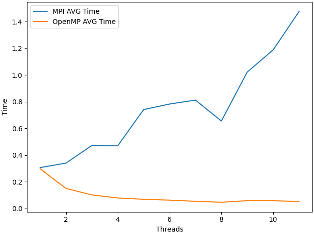
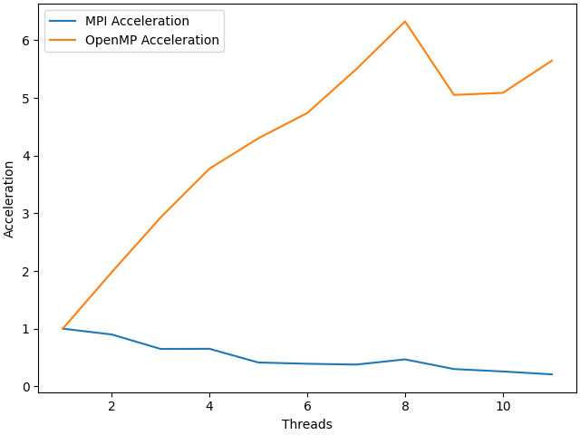
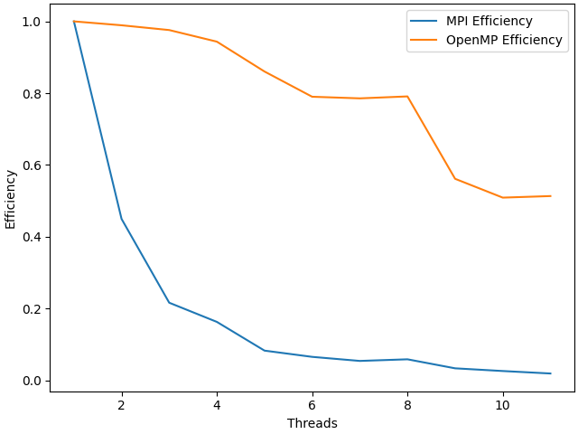

# НИЯУ МИФИ. Лабораторная работа №5. Давыдов Михаил, Б21-502. 2023
---

### Используемая система

**Операционная система** - Linux 6.6.7-arch1-1 x86_64

**Модель процессора** - 12th Gen Intel® Core™ i5-12500H

**Оперативная память** - LPDDR4 3733 MT/s 16GB

**Среда разработки** - `Neovim`

**Версия OpenMP** - `201511`


### Информация о версии MPI
mpicc: Open MPI 4.1.6 (Language: C)

### Блок-схема алгоритма


### Временная оценка алгоритма

$O(n/p)$

`n` - число элементов в массиве

`p` - число используемых потоков

### Сравнительный анализ

#### Среднее время


#### Среднее ускорение

#### Средняя эффективность



### Заключение
В данной лабораторной работе была настроена среда для работы с OpenMPI, изучена первая программа, написанная с использованием технологии MPI, и проведен сравнительный анализ времени работы, эффективности и ускорения данной программы с программой, реализующей тот же функционал, но написанной с использованием технологии OpenMP. В результате стало очевидно, что программа, написанная с использованием OpenMPI тратит большую часть времени работы на пересылку данных между процессами, однако данный результат не является показательным для программы столь малого размера.


### Приложениe

#### Программа для оценки времени работы параллельной программы

```c
#include <stdlib.h>
#include <stdio.h>
#include <mpi.h>
#include <omp.h>

int main(int argc, char** argv)
{
	int ret  = -1;	///< For return values
	int size = -1;	///< Total number of processors
	int rank = -1;	///< This processor's number

	const int count = 100000000;; ///< Number of array elements

	int* array = 0; ///< The array we need to find the max in
	int lmax = -1;	///< Local maximums
	int  max = -1;  ///< The maximal element
  double start, end;

  const int random_seed = atoi(argv[1]); ///< RNG seed
	/* Initialize the MPI */
	ret = MPI_Init(&argc, &argv);

	/* Determine our rank and processor count */
	MPI_Comm_size(MPI_COMM_WORLD, &size);
	MPI_Comm_rank(MPI_COMM_WORLD, &rank);

	/* Allocate the array */
  array = (int*)malloc(count * sizeof(int));
  if(!rank){
    srand(random_seed);
    for (int i = 0; i < count; i++) { array[i] = rand(); }
  }
    
  start = MPI_Wtime();
	MPI_Bcast(array, count, MPI_INTEGER, 0, MPI_COMM_WORLD);

	const int wstart = (rank    ) * count / size;
	const int wend   = (rank + 1) * count / size;

	for (int i = wstart; i < wend; i++){
		if (array[i] > lmax){ 
            lmax = array[i]; 
      }
	}

	MPI_Reduce(&lmax, &max, 1, MPI_INTEGER, MPI_MAX, 0, MPI_COMM_WORLD);
	  end = MPI_Wtime();
	ret = MPI_Finalize();
  if (!rank) {
    printf("%g\n", end-start);
  }
	return(0);
}
```
