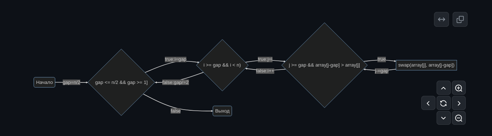
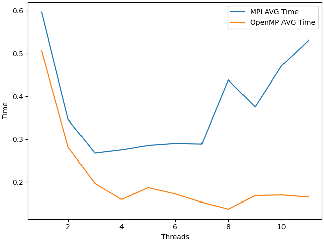
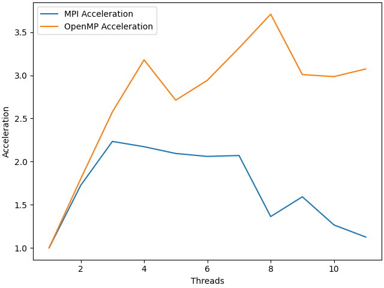
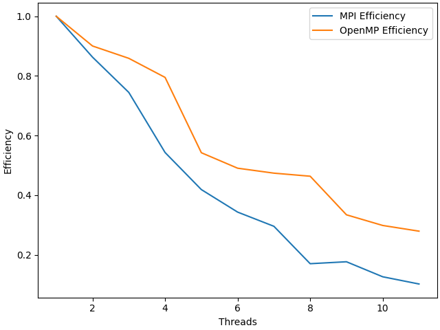

# НИЯУ МИФИ. Лабораторная работа №5. Давыдов Михаил, Б21-502. 2023
---

### Используемая система

**Операционная система** - Linux 6.6.7-arch1-1 x86_64

**Модель процессора** - 12th Gen Intel® Core™ i5-12500H

**Оперативная память** - LPDDR4 3733 MT/s 16GB

**Среда разработки** - `Neovim`

**Версия OpenMP** - `201511`


### Информация о версии MPI
mpicc: Open MPI 4.1.6 (Language: C)

### Aлгоритм

#### Описание алгоритма 

* Весь массив делится на N частей (непересекающихся множеств), где N - колчичество потоков, при это главному потоку достается N-ый участок массива.
* Каждый ранг получает свою часть массива, сортирует ее с помощью сортировки Шелла возвращает уже отсортированной.
* Главный поток затем собирает все отсортированные части и выполняет финальную сортировку Шелла.



#### Временная оценка алгоритма

$O(n^2/p)$

`n` - число элементов в массиве

`p` - число используемых потоков

### Экспериментальные вычисления

#### Среднее время


#### Среднее ускорение


#### Средняя эффективность


### Заключение
В данной работе был разработан алгоритм сортировки Шелла с использованием параллелизма за счет технологии OpemMPI и проведено сравнение аналогичной программы, созданной с помощью технологии OpenMP. В результате заметно улучшение времени работы программы, созданной с применением технологии OpenMPI, однако пересылка данных между потоками все еще забирает ощутимую долю времени выполнения программы.

### Приложение

#### Программа для оценки времени работы параллельной программы

```c
#include <mpi.h>
#include <stdio.h>
#include <stdlib.h>


void initArray(int *array, int len , int seed) {
    srand(seed);
    for (int i = 0; i < len; i++) {
        array[i] = rand();
    }
}


void shellSort(int *array, int len) {
    for(int gap = len/2; gap > 0; gap/=2){
        for(int i = gap; i < len; i++){
            for(int j=i; j>=gap  && array[j-gap] > array[j]; j-=gap){
                int tmp = array[j];
                array[j] = array[j-gap];
                array[j-gap] = tmp;
            }
        }
    }
}

int main(int argc, char **argv) {
    if(argc != 2) {
        return 1;
    }
    int size, rank;
    double startTime;
    MPI_Status status;
    int arraySize = 1000000;

    long seed = atol(argv[1]);

    int ret = MPI_Init(&argc, &argv);

    int *array = calloc(arraySize, sizeof(int));
    MPI_Comm_size(MPI_COMM_WORLD, &size);
    MPI_Comm_size(MPI_COMM_WORLD, &rank);
    
    int n = arraySize /size;

    if (rank == 0) {
        initArray(array, arraySize, seed);
        seed += rand();
        startTime = MPI_Wtime();

        for (int i = 0; i < size; i++) {
            MPI_Send(array + n * (i - 1), n , MPI_INT, i, 0, MPI_COMM_WORLD);
        }
        shellSort(array + n * (size - 1), arraySize - n  * (size - 1));

        for (int i = 0; i < size - 1; i++) {
            MPI_Recv(array + n * i, n, MPI_INT, MPI_ANY_SOURCE, 1, MPI_COMM_WORLD, &status);
        }

        shellSort(array, arraySize);

        fprintf(stdout, "%g\n", MPI_Wtime() - startTime);
        free(array);
    } else {
        int *cur = calloc(n, sizeof(int));
        MPI_Recv(cur, n, MPI_INT, 0, 0, MPI_COMM_WORLD, &status);
        shellSort(cur, n);
        MPI_Send(cur, n, MPI_INT, 0, 1, MPI_COMM_WORLD);
    }
}
```
